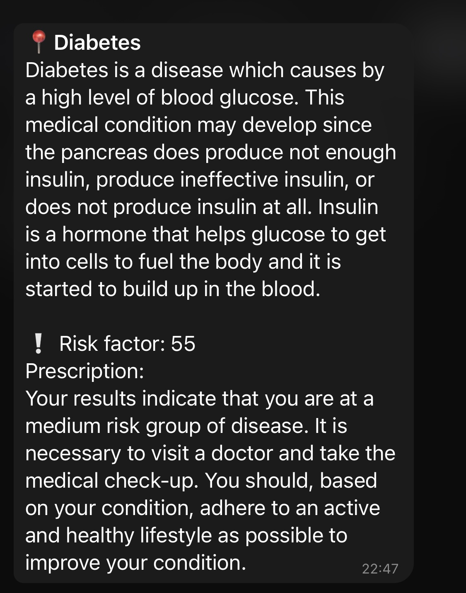
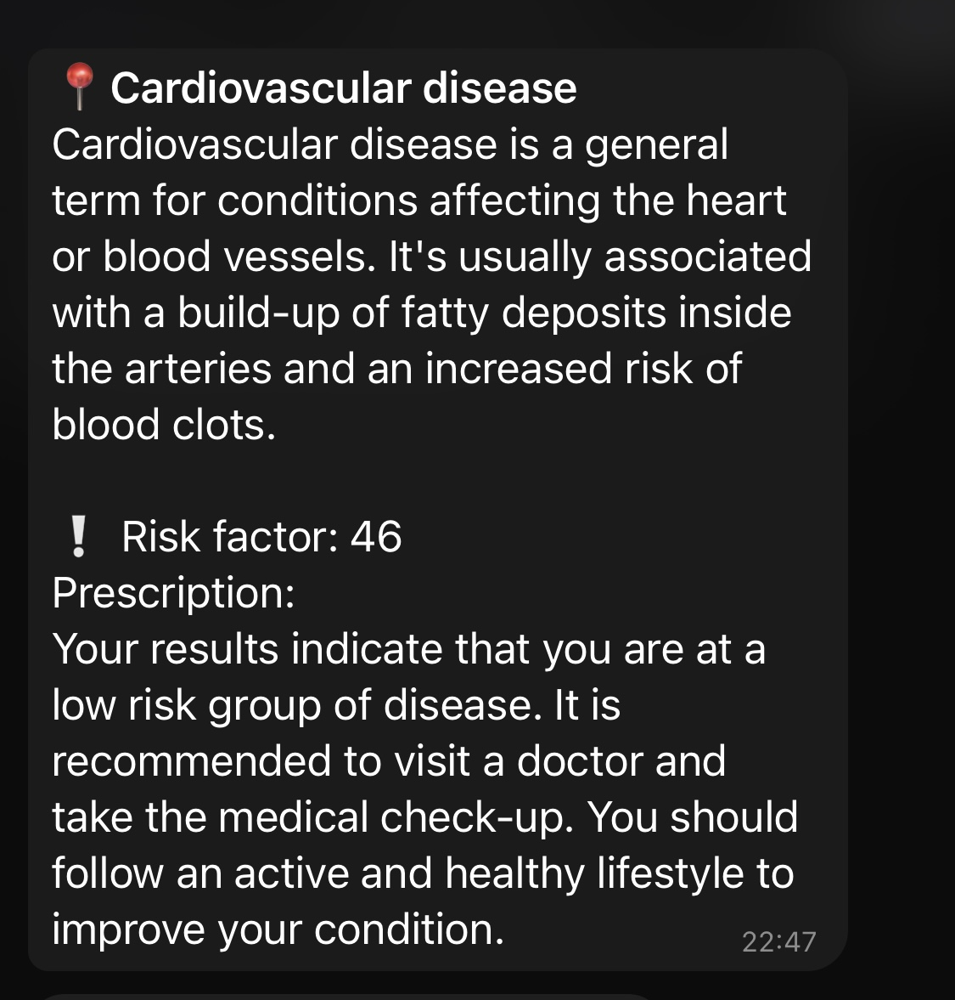
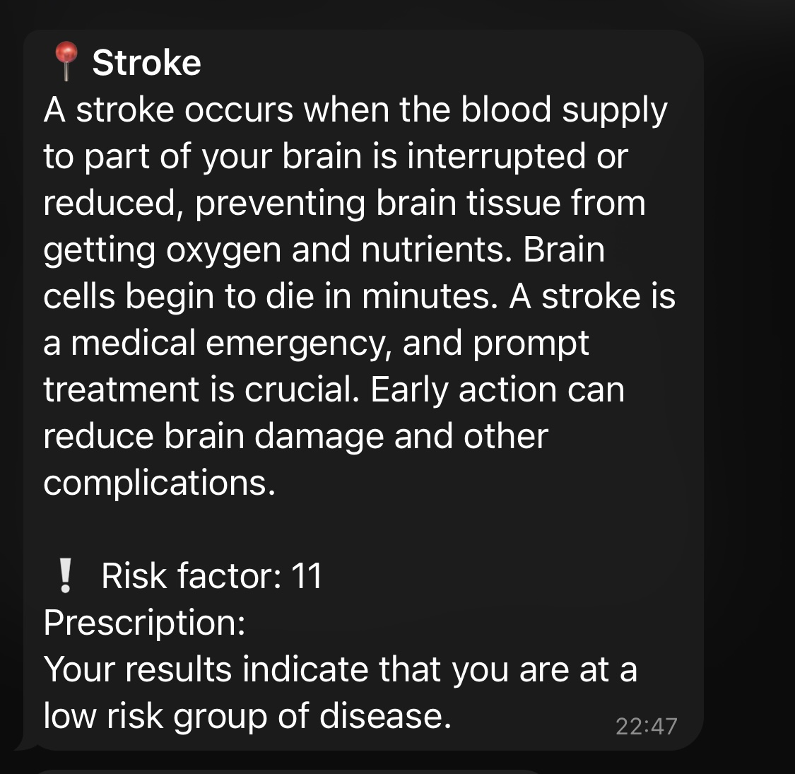
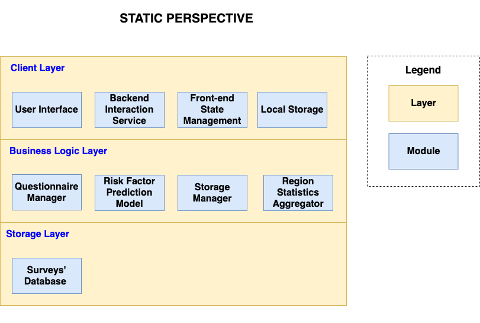
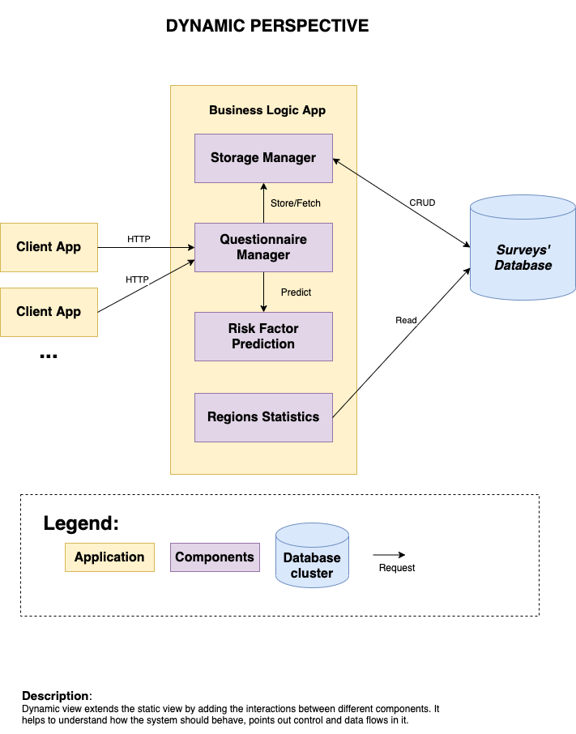
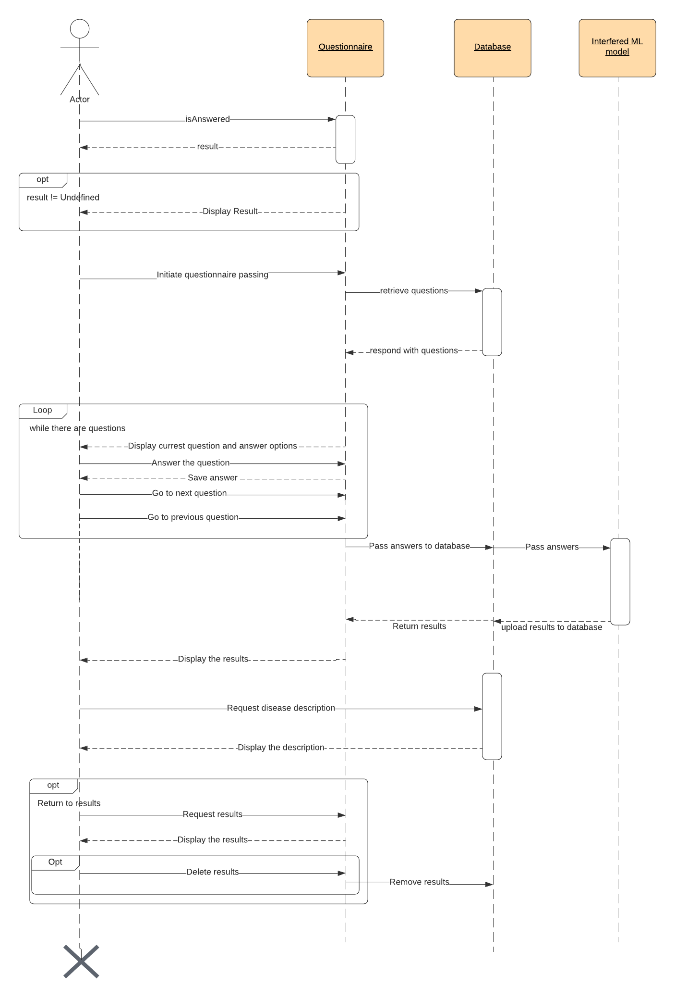

   
  

# Doctorinna - open-source medical risk factor analyzer
**Authors:** Lada Morozova, Denis Schegletov, Danis Alukaev, Maxim Pryanikov. \
**Group:** B19-DS-01, Innopolis University.

> This is the overview repository primarily used for documentation, for implementation details see [Structure of project](#structure) section

Doctorinna is an open-source application for determining the user's risk group for the widespread diseases by medical parameters. 
This application will allow people in the form of a survey without undergoing a medical examination to understand
whether it is necessary to be examined by a doctor and change their lifestyle.

## Our services
If you want to use our application without installation you can use **[web application](https://doctorinna.vercel.app)** or **[Telegram bot](https://t.me/doctorinna_bot)**

If you want to build our application on local machine use
**[Docker image with stable versions](https://github.com/Doctorinna/overview/blob/master/docker-compose.yml)**

If you want to contribute check **[our API](https://github.com/Doctorinna/backend/tree/dev)**
## Demo

Results based on data provided in demo video:

## Table of content
- [Motivation](#motivation)
- [Structure of project](#structure)
- [Requirements](#requirements)
    - [Featues](#features)
    - [Stakeholders](#stakeholders)
    - [User stories](#stories)
    - [Non-functional requirements](#nfr)
    - [Glossary](#glossary)
- [Architecture](#Architecture)
    - [Static view diagram](#static)
    - [Dynamic view diagram](#dynamic)
- [Design](#design)
    - [Sequence diagram](#sequence)
    - [Design patterns](#patterns)
- [Technology stack](#stack)
- [Code](#code)
    - [Static analyzer](#static_analyzer)
    - [Test coverage and code quality](#test_coverage)

### Motivation 
A modern person prefers not to think about the fact that sooner or later his or her life will end. Our old age is so far away. So much so that it is easy for it to get lost in everyday studies, tedious work, questionable entertainment, quick snacks and hours of communication on social networks.

Doctorinna is our attempt to create a product that sobers the modern generation. This open-source product allows you to determine your risk group for the most common diseases by answering questions related to body parameters, habits and heredity. To do this, machine learning models will be trained on publicly available data from patients with diabetes, cardiovascular disease, stroke and lung cancer. The list of diseases will increase as the project develops. An important feature of the project will be a system of recommendations for improving your health.

Our goal is to distract you from the flow of digital garbage for at least a minute, and ask the question, _what are you doing to live to old age?_

### Structure of project 
It was decided to build a backend API implemented on the Django REST Framework. It will contain the business logic of the application.

In our opinion, the main flow of users might come through the web version of the application and the Telegram bot. 
Therefore, it was decided to implement them first within the framework of the Software System Analysis and Design course.

Accordingly, the code is distributed into 3 repositories: 
- [Backend](https://github.com/Doctorinna/backend)
- [Frontend](https://github.com/Doctorinna/frontend)
- [Telegram bot](https://github.com/Doctorinna/telegram-bot)

Each repository has a detailed description of how to launch correspondent side of the project locally.

##  Requirements 
### Features 
| Feature Title                   	| Priority 	|
|---------------------------------	|----------	|
| Questionnaire                   	| Must     	|
| Data analysis                   	| Must     	|
| Graphical Design                	| Must     	|
| Database Design                 	| Must     	|
| Available on multiple platforms 	| Could    	|
### Stakeholders  

| Stakeholder’s Name |  Roles                                                                                                                                  | Responsibilities                                                                                                                                                                                                                              |
|--------------------|-----------------------------------------------------------------------------------------------------------------------------------------|-----------------------------------------------------------------------------------------------------------------------------------------------------------------------------------------------------------------------------------------------|
| Developer          | Front Developer  Backend Developer  Database Administrator  Machine Learning Engineer  Telegram bot Developer  | Develop the graphical interface for a web application.  Develop backend API.  Develop Telegram-bot.  Build a pipeline for statistical analysis.  Train model for health risk assessment.  Deploy applications.  |
| QA engineer        | Software Tester  Test Analyst                                                                                                 | Testing of application.  Configuration of test automation.  Requirement analysis                                                                                                                                               |
| User               | Web application User  Telegram bot User                                                                                       | Use an application.  Pass the questionnaire.  Give feedback.                                                                                                                                                                   |
| Product Owner      | Project Manager  Business Analytic                                                                                            | Rejecting/accepting project  Provide business requirements  Task management.  Risk identification.  Project vision.                                                                                                  |

### User stories 
Web application / Telegram bot user play the role of user in the project. 

|  User Story Title  	| User stories                                                                                                                                                                                                                                                                                                                                                                                                                                                         	|
|-----------------------	|----------------------------------------------------------------------------------------------------------------------------------------------------------------------------------------------------------------------------------------------------------------------------------------------------------------------------------------------------------------------------------------------------------------------------------------------------------------------	|
| Questionnaire         	| 1.1. As a user, I want to know my health risk group for different diseases, so that I will be able to draw a conclusion about my lifestyle.  1.2. As a user, I want to answer only questions that do not require a medical examination, so that I do not have to waste time going to the doctor.                                                                                                                                                                  	|
| Graphical Design      	| 2.1. As a user, I want to interact with a user-friendly web interface, so that I can make fewer misclicks. 2.2. As a user, I want my health group to be illustrated using graphs, so that I can visually see statistics about me.                                                                                                                                                                                                                                 	|
| Statistics            	| 3.1. As a user, I want to see the statistics about the health risks in different regions of Russia, so that I can compare various regions by the number of disease risks. 3.2. As a user, I want to see my result in the distribution of health risks of all users, so that I can compare it with overall disease risk frequency. 3.3. As a user I want my data to be processed by artificial intelligence, so that the result will be statistically justified 	|
| Telegram bot          	| 4.1. As a user, I want to take a survey through a Telegram bot, so that I can share my results with friends.                                                                                                                                                                                                                                                                                                                                                         	|
| User error protection 	| 5.1. As a user, I want the service to guide me when entering data, so that I did everything right on the first try.                                                                                                                                                                                                                                                                                                                                                  	|
| Confidentiality       	| 6.1. As a user, I want the questionnaire to be anonymous, so that my identity will not be revealed.                                                                                                                                                                                                                                                                                                                                                                  	|
| Accessibility         	| 7.1. As a user, I want to have access to the service in the web version, so that I do not need to install new applications on my device. 7.2. As a user, I want the service to be free, so that I could find out my risk group without having free funds.                                                                                                                                                                                                         	|
| Accessibility         	| 7.1. As a user, I want to have access to the service in the web version, so that I do not need to install new applications on my device.  7.2. As a user, I want the service to be free, so that I could find out my risk group without having free funds.                                                                                                                                                                                                        	|

### Non-Functional requirements 
| Non-Functional  Requirement Title 	| How to meet  Non-Functional Requirement                                                                                                                                                                                                                       	| How to measure Non-Functional requirement                                                                        	|
|--------------------------------------	|------------------------------------------------------------------------------------------------------------------------------------------------------------------------------------------------------------------------------------------------------------------	|---------------------------------------------------------------------------------------------------------------------	|
| Modularity                           	| Implement the backend following microservices architecture, i.e., divided by loosely-coupled services. Implement the frontend divided into interface components and the global state of the system that is controlled by the state management system (Redux). 	| Number of modules; The size of each module with respect to the project; Number of connections between modules 	|
| Reusability                          	| Implement the backend API allowing to build services on top of it, e.g. web frontend, Telegram bot, mobile app, etc.                                                                                                                                             	| How easily service can be integrated                                                                                	|
| User error protection                	| Checking correctness of user data and preventing from making errors by user interface.                                                                                                                                                                           	| Number of user’s clicks before achieving correct result is less than 3; Number of invalid data imputed by user   	|
| Confidentiality                      	| The results of the analysis of responses will be saved to the database without binding to the user's identity. The data requested from the client side of the application cannot be used to determine the identity of other users.                               	| No records in database containing any personal data                                                                 	|
| Installability                       	| The installation manual is clear and does not require deep knowledge                                                                                                                                                                                             	| Number of commands required to install                                                                              	|
### Glossary 
- **Cardiovascular Disease** - disease is a general term for conditions affecting the heart or blood vessels.
- **Diabetes** - disease which is caused by a high level of blood glucose.
- **Stroke** - stroke occurs when the blood supply to part of your brain is interrupted or reduced, preventing brain tissue from getting oxygen and nutrients.
- **Lung cancer** - type of cancer that begins in the lungs.
- **REST** - architecture that are typically loosely based on HTTP methods to access resources via URL-encoded parameters and the use of JSON or XML to transmit data.
- **Microservice** - architecture that arranges an application as a collection of loosely-coupled services. Opposed to monolithic architecture.
- **CRUD** - Create, Read, Update, Delete - 4 basic operations of persistent storage.
- **Serializer/DTO** - data structure in backend that can be converted to JSON and back, and then send to frontend.
- **Entity/Model(Backend)** - data structure used in backend that is mapped to table in SQL database.
- **Repository** - Github repository of organization Doctorinna.
- **Component (Frontend)** - group of HTML elements, that can be reused multiple times and structuralized code.
- **Logger (Backend)** - log the information about all activities to retrieve bugs more easily.
- **Risk group** - medical risk group of user. There are 4 types of risk groups: no risk, low risk, medium risk, high risk.
- **Component (UML)** - modular part of the system that encapsulate the state and behavior of a number classifiers.
- **State manager (Frontend)** - object that controls state in all application and send this state to components.
- **Service (Backend)** - part of the Backend that contains business logic.
- **Controller/urls (Backend)** - part of the Backend that contains sending and receiving information using HTTP methods.
- **Local Storage** - persistent storage in browser that can store key-value pairs.
- **RUP** - Rational Unified Process.
- **SSR** - Server Side Rendering. Technique to render web page in server and deliver to client already rendered (but it can be rerendered later on client side).
- **Questionnaire** - set of questions that are answered by users, processed by system and results are displayed on user interface.
- **Bot** - Telegram bot.
- **User** - web Users of the web application or telegram bot.

## Architecture 
### Static view 
Static view presents the main modules of the system and their hierarchy in an abstract way

### Dynamic view 
Dynamic view extends the static view by adding the interactions between different components.

## Design 
### Sequence diagram 
Sequence diagram presents the sequence of events occurring in the system, interactions between entities and their lifespans.

### Design patterns 
The backend side of the application is implemented in Django REST Framework. A significant number of design patterns are used in this framework. Therefore, in the course of our work, we indirectly use them. 

 **Examples of used design patterns:**
 - **Factory design** pattern is used for creation of fields in forms 
 - **Observer** is used to register callback functions executed when fields in models were changed

 For more detailed explanation of used design patterns, please check [Gamma Delivery]().

## Technology stack 
| Backend               	| Frontend      	| Telegram bot      	|
|-----------------------	|---------------	|-------------------	|
| Django REST framework 	| React         	| aiogram framework 	|
| Python                	| Next.js       	| Python            	|
| Docker                	| Redux         	| Docker            	|
| PostgreSQL            	| Typescript    	| Redis             	|
| Nginx                 	| Npm           	|                   	|
| Gunicorn              	| HTML          	|                   	|
| RabbitMq              	| SCSS          	|                   	|
| Celery                	| Jest + Enzyme 	|                   	|
| Scikit-learn          	| Material-ui   	|                   	|

## Code 
### Static analyzer 

### Test coverage and code quality 
| Backend                                                                                                                                                                                                                                                              	| Frontend                                                                                                                                                                                                                                                               	| Telegram bot                                                                                                                                                                                                                                                                              	|
|----------------------------------------------------------------------------------------------------------------------------------------------------------------------------------------------------------------------------------------------------------------------	|------------------------------------------------------------------------------------------------------------------------------------------------------------------------------------------------------------------------------------------------------------------------	|-------------------------------------------------------------------------------------------------------------------------------------------------------------------------------------------------------------------------------------------------------------------------------------------	|
|  	|  	|  	|
|                                                                                                                  	|                                                                                                                       	|                                                                                                                                                                                                                                                                                           	|
|                                                                                       	|                                                                                                                                                                                                                                                                        	|                                                                                                                                                                                                                                                                                           	|